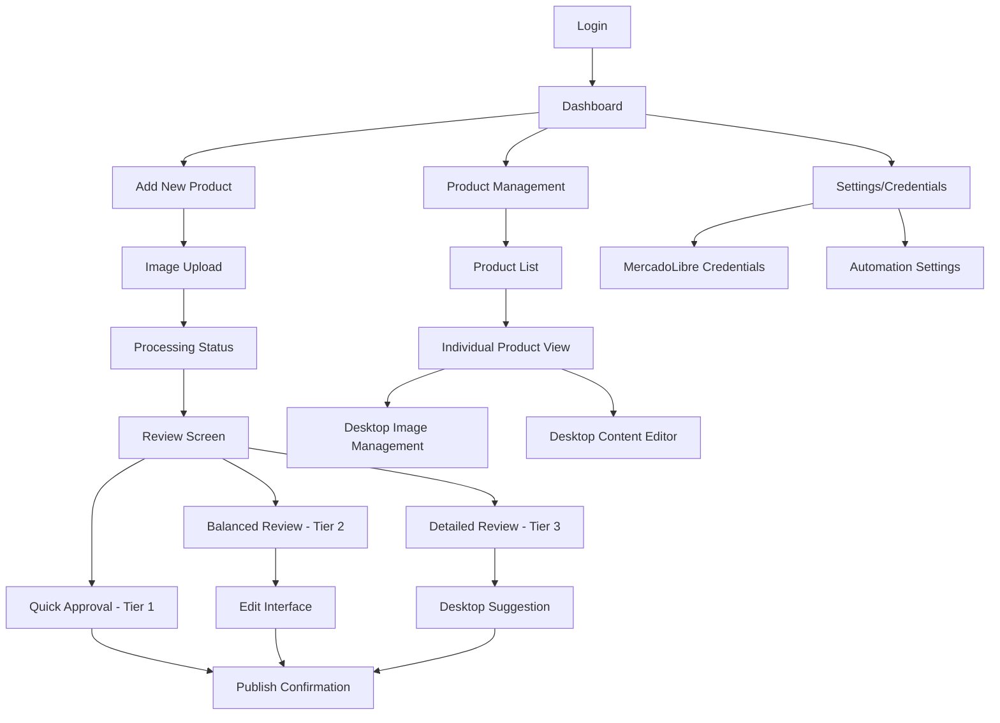
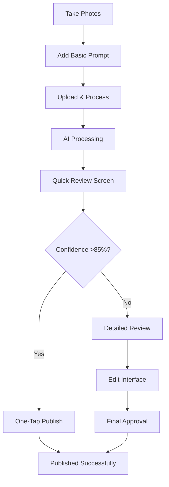
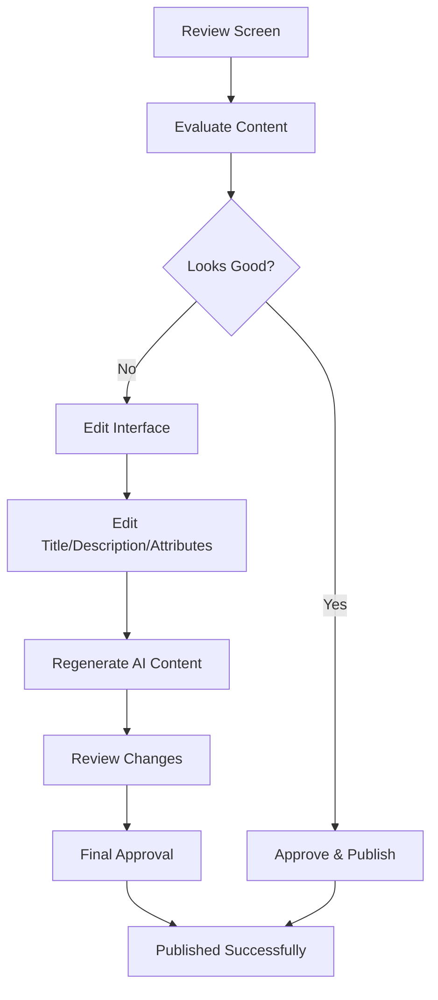
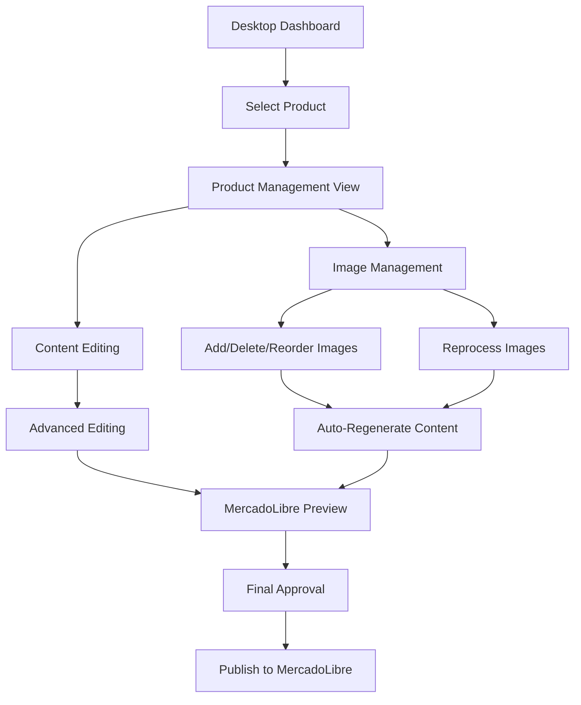

# IntelliPost AI UI/UX Specification

## Introduction

This document defines the user experience goals, information architecture, user flows, and visual design specifications for IntelliPost AI's user interface. It serves as the foundation for visual design and frontend development, ensuring a cohesive and user-centered experience.

### Overall UX Goals & Principles

#### Target User Personas

- **SME Sellers:** Small to medium-sized enterprise owners who need to quickly create professional listings on MercadoLibre. They value efficiency and want to reduce the time spent on listing creation by 90%.
- **Sole Proprietors:** Individual sellers who use mobile devices primarily and need a streamlined, mobile-complete workflow for listing creation.
- **Power Users:** Experienced sellers who want detailed control over their listings and prefer desktop interfaces for complex editing and image management.

#### Usability Goals

- **Time to First Listing:** New users can complete their first listing within 5 minutes of active interaction time
- **Mobile Completion Rate:** 90% of workflows can be completed on mobile devices without requiring desktop access
- **Approval Efficiency:** High-confidence listings (>85%) can be approved with a single tap
- **Error Recovery:** Users can recover from 90% of error states without abandoning their workflow
- **Learning Curve:** Interface adapts to user confidence level, showing more or less detail based on AI certainty

#### Design Principles

1. **Mobile-Complete, Desktop-Optional** - All essential workflows must be completable on mobile, with desktop providing enhanced capabilities
2. **Confidence-Driven Interface** - UI adapts based on AI confidence scores, showing appropriate levels of detail and control
3. **Progressive Disclosure** - Show only what's needed when it's needed, with options to expand for more detail
4. **Immediate Feedback** - Every action should have clear, immediate response with confidence indicators
5. **Professional Minimalism** - Clean, modern design that conveys professionalism and efficiency

### Change Log

| Date | Version | Description | Author |
| :--- | :------ | :---------- | :----- |
| 2025-06-20 | 1.0 | Initial frontend specification creation | Claude Code |

## Information Architecture (IA)

### Site Map / Screen Inventory

### Navigation Structure

**Primary Navigation:** 
- Mobile: Bottom navigation bar with Dashboard, Add Product, and Settings
- Desktop: Top navigation bar with Dashboard, Products, and Settings

**Secondary Navigation:** 
- Mobile: Contextual navigation within workflows (Back, Next, Edit)
- Desktop: Sidebar navigation for product management functions

**Breadcrumb Strategy:** 
- Mobile: Minimal breadcrumbs, focus on contextual back buttons
- Desktop: Full breadcrumb trail for complex workflows

## User Flows

### Mobile Quick Approval Flow (High Confidence >85%)

**User Goal:** Create and publish a listing with minimal effort using high-confidence AI results

**Entry Points:** Dashboard "Add New Product" button, Camera shortcut

**Success Criteria:** Product published to MercadoLibre within 30 seconds of image capture

#### Flow Diagram

**Edge Cases & Error Handling:**
- Poor image quality: Suggest retaking photos with tips
- Network interruption: Auto-save progress and resume when connection restored
- API failure: Provide retry option with clear error messaging

**Notes:** This flow is optimized for speed and confidence, with clear visual indicators of AI certainty

### Mobile Balanced Review Flow (Medium Confidence 70-85%)

**User Goal:** Review and approve AI-generated content with basic editing capabilities

**Entry Points:** Dashboard, or escalation from Quick Approval flow

**Success Criteria:** User can review, edit, and approve listing within 3 minutes

#### Flow Diagram

**Edge Cases & Error Handling:**
- Uncertain category: Provide category picker with suggestions
- Missing attributes: Highlight required fields with helpful hints
- Content too long: Auto-truncate with option to manually adjust

**Notes:** Balances speed with control, showing component-level confidence scores

### Desktop Power Management Flow (Low Confidence <70%)

**User Goal:** Use advanced editing tools to perfect listing content and manage images

**Entry Points:** Desktop login, mobile suggestion, or direct product management

**Success Criteria:** User can access full editing capabilities and image management tools

#### Flow Diagram

**Edge Cases & Error Handling:**
- Image processing failure: Show original with manual editing options
- Complex attribute requirements: Provide guided attribute completion
- API rate limiting: Queue requests with progress indicators

**Notes:** Full-featured interface with before/after comparisons and advanced controls

## Wireframes & Mockups

**Primary Design Files:** To be created in Figma following this specification

### Key Screen Layouts

#### Mobile Dashboard

**Purpose:** Central hub for managing all products with priority-based organization

**Key Elements:**
- Add New Product button (prominent, camera-enabled)
- Priority sections: Ready to Publish, Needs Attention, Published
- Color-coded status indicators (🟢🟡🔴)
- Quick action buttons for each product
- Pull-to-refresh functionality

**Interaction Notes:** Touch-optimized with large tap targets, swipe gestures for secondary actions

**Design File Reference:** figma-mobile-dashboard.fig

#### Mobile Review Screen (Tier 1 - High Confidence)

**Purpose:** Quick approval interface for high-confidence AI results

**Key Elements:**
- Prominent confidence indicator (🟢 Ready to publish! 87%)
- Main product image with swipe comparison (original ↔ AI enhanced)
- Essential product information (title, category)
- Large "Publish Now" primary button
- Secondary "Review Details" option

**Interaction Notes:** Swipe gestures for image comparison, single-tap approval

**Design File Reference:** figma-mobile-tier1-review.fig

#### Mobile Edit Interface

**Purpose:** Comprehensive editing capabilities within mobile constraints

**Key Elements:**
- Tabbed interface for different content types
- Prompt editing with regeneration trigger
- Direct editing of title, description, and key attributes
- Category selector with mobile-optimized picker
- Auto-save indicators and manual save controls

**Interaction Notes:** Form-based editing with real-time validation and auto-save

**Design File Reference:** figma-mobile-edit.fig

#### Desktop Product Management

**Purpose:** Advanced editing and image management hub

**Key Elements:**
- Split-view layout: User Inputs | AI Generated Results
- Full image CRUD interface with drag-and-drop
- Side-by-side comparison views
- Detailed confidence breakdowns
- MercadoLibre preview functionality

**Interaction Notes:** Mouse-based interactions with hover states, drag-and-drop for image management

**Design File Reference:** figma-desktop-management.fig

#### Desktop Dashboard

**Purpose:** Comprehensive product overview with advanced filtering and management

**Key Elements:**
- Searchable product table with sortable columns
- Advanced filters (status, confidence, category)
- Bulk action capabilities (future enhancement)
- Detailed status indicators and direct action buttons

**Interaction Notes:** Standard desktop patterns with keyboard shortcuts for power users

**Design File Reference:** figma-desktop-dashboard.fig

## Component Library / Design System

**Design System Approach:** Custom design system optimized for mobile-first, confidence-driven interfaces

### Core Components

#### Confidence Indicator

**Purpose:** Visual representation of AI confidence levels with appropriate messaging

**Variants:** High (>85%), Medium (70-85%), Low (<70%)

**States:** Static display, animated processing, interactive tooltip

**Usage Guidelines:**
- High confidence: Green color, encouraging messaging ("Ready to publish!")
- Medium confidence: Yellow color, verification messaging ("Good, please verify")
- Low confidence: Red color, attention messaging ("Needs attention")

#### Image Comparison Slider

**Purpose:** Before/after comparison for AI-processed images

**Variants:** Mobile swipe, Desktop slider, Thumbnail grid

**States:** Loading, Interactive, Comparison mode

**Usage Guidelines:**
- Mobile: Swipe gesture with clear indicators
- Desktop: Drag slider with precise control
- Always show processing indicators during AI enhancement

#### Action Button

**Purpose:** Primary and secondary actions with confidence-appropriate styling

**Variants:** Primary (Publish), Secondary (Edit), Tertiary (Cancel), Destructive (Delete)

**States:** Default, Hover, Active, Disabled, Loading

**Usage Guidelines:**
- Primary actions match confidence level (green for high confidence)
- Loading states show processing indicators
- Disabled states provide clear feedback on requirements

#### Product Status Card

**Purpose:** Compact product representation with status and actions

**Variants:** Dashboard card, List item, Detailed view

**States:** Processing, Ready, Needs attention, Published, Error

**Usage Guidelines:**
- Color coding matches confidence system
- Clear next action indicated
- Status changes animate smoothly

#### Edit Field Group

**Purpose:** Grouped editing controls for different content types

**Variants:** Text input, Dropdown selector, Multi-line textarea, Category picker

**States:** Default, Focus, Error, Success, Loading

**Usage Guidelines:**
- Auto-save indicators for all fields
- Real-time validation with helpful error messages
- Regeneration triggers clearly marked

## Branding & Style Guide

### Visual Identity

**Brand Guidelines:** IntelliPost AI professional, modern, efficiency-focused brand

### Color Palette

| Color Type    | Hex Code | Usage                                    |
| :------------ | :------- | :--------------------------------------- |
| **Primary**   | #2563EB  | Primary actions, high confidence states  |
| **Secondary** | #64748B  | Secondary actions, neutral states        |
| **Accent**    | #7C3AED  | Accent elements, AI processing indicators|
| **Success**   | #059669  | High confidence, positive feedback       |
| **Warning**   | #D97706  | Medium confidence, attention needed      |
| **Error**     | #DC2626  | Low confidence, errors, destructive actions |
| **Neutral**   | #64748B, #94A3B8, #F1F5F9 | Text, borders, backgrounds |

### Typography

**Font Families:**
- **Primary:** Inter (sans-serif) - Clean, modern, highly readable
- **Secondary:** system-ui fallback for performance
- **Monospace:** Menlo, Monaco, 'Courier New' for technical displays

**Type Scale:**
| Element | Size | Weight | Line Height |
|:--------|:-----|:-------|:------------|
| H1 | 32px | 700 | 1.2 |
| H2 | 24px | 600 | 1.3 |
| H3 | 20px | 600 | 1.4 |
| Body | 16px | 400 | 1.5 |
| Small | 14px | 400 | 1.4 |
| Caption | 12px | 500 | 1.3 |

### Iconography

**Icon Library:** Heroicons (outline and solid variants)

**Usage Guidelines:** 
- Outline icons for interface elements
- Solid icons for status indicators and filled states
- Consistent sizing: 16px (small), 20px (medium), 24px (large)

### Spacing & Layout

**Grid System:** 4px base unit with 8px, 16px, 24px, 32px, 48px, 64px scale

**Spacing Scale:** 
- xs: 4px, sm: 8px, md: 16px, lg: 24px, xl: 32px, 2xl: 48px, 3xl: 64px

## Accessibility Requirements

### Compliance Target

**Standard:** WCAG 2.1 AA compliance for MVP fundamentals

### Key Requirements

**Visual:**
- Color contrast ratios: 4.5:1 for normal text, 3:1 for large text
- Focus indicators: 2px solid outline with sufficient contrast
- Text sizing: Minimum 16px for body text, scalable up to 200%

**Interaction:**
- Keyboard navigation: Tab order follows logical flow, all interactive elements accessible
- Screen reader support: Proper ARIA labels, role attributes, and heading hierarchy
- Touch targets: Minimum 44x44px for mobile, adequate spacing between elements

**Content:**
- Alternative text: Descriptive alt text for all images and icons
- Heading structure: Logical H1-H6 hierarchy with no skipped levels
- Form labels: Clear, associated labels for all form inputs

### Testing Strategy

- Automated accessibility testing with axe-core
- Manual keyboard navigation testing
- Screen reader testing with NVDA/JAWS
- Color contrast validation with WebAIM tools

## Responsiveness Strategy

### Breakpoints

| Breakpoint | Min Width | Max Width | Target Devices           |
| :--------- | :-------- | :-------- | :----------------------- |
| Mobile     | 320px     | 767px     | Smartphones, small tablets |
| Tablet     | 768px     | 1023px    | Tablets, small laptops    |
| Desktop    | 1024px    | 1439px    | Laptops, desktop monitors |
| Wide       | 1440px    | -         | Large monitors, wide screens |

### Adaptation Patterns

**Layout Changes:** 
- Mobile: Single column, stacked layout
- Tablet: Optimized mobile layout with larger touch targets
- Desktop: Multi-column layout with sidebar navigation

**Navigation Changes:**
- Mobile: Bottom navigation, hamburger menu
- Tablet: Hybrid navigation with expanded bottom bar
- Desktop: Top navigation with full menu visibility

**Content Priority:**
- Mobile: Essential information first, progressive disclosure
- Tablet: Moderate detail with expandable sections
- Desktop: Full information display with detailed controls

**Interaction Changes:**
- Mobile: Touch-optimized with swipe gestures
- Tablet: Hybrid touch/mouse interaction
- Desktop: Mouse-optimized with keyboard shortcuts

## Animation & Micro-interactions

### Motion Principles

- **Purposeful:** Every animation serves a functional purpose
- **Performant:** 60fps animations using CSS transforms and opacity
- **Respectful:** Honors user preferences for reduced motion
- **Subtle:** Enhances without distracting from core tasks

### Key Animations

- **Confidence Indicator:** Smooth color transitions (200ms ease-in-out)
- **Image Comparison:** Swipe transition with momentum (300ms cubic-bezier)
- **Status Updates:** Gentle bounce animation for status changes (400ms ease-out)
- **Loading States:** Skeleton screens with shimmer effect (1500ms linear loop)
- **Page Transitions:** Slide transitions for mobile navigation (250ms ease-in-out)

## Performance Considerations

### Performance Goals

- **Page Load:** <3 seconds for initial dashboard load
- **Interaction Response:** <100ms for immediate feedback
- **Animation FPS:** Consistent 60fps for all animations

### Design Strategies

- **Image Optimization:** WebP format with fallbacks, responsive images
- **Lazy Loading:** Progressive loading for image galleries
- **Component Splitting:** Code splitting for mobile vs desktop interfaces
- **Caching Strategy:** Aggressive caching for static assets
- **Progressive Enhancement:** Core functionality works without JavaScript

## Next Steps

### Immediate Actions

1. **Stakeholder Review:** Present specification to development team and product stakeholders
2. **Figma Prototypes:** Create detailed visual designs and interactive prototypes
3. **Technical Handoff:** Collaborate with Frontend Architect on implementation strategy

### Design Handoff Checklist

- [x] All user flows documented with detailed wireframes
- [x] Component inventory complete with states and variants
- [x] Accessibility requirements defined with specific criteria
- [x] Responsive strategy clear with breakpoint specifications
- [x] Brand guidelines incorporated with complete color and typography systems
- [x] Performance goals established with measurable targets
- [x] Animation specifications defined with timing and easing
- [x] Cross-platform strategy documented with confidence-driven adaptation
- [x] Error handling and edge cases addressed in user flows

## Checklist Results

This frontend specification successfully addresses all key requirements for the IntelliPost AI mobile-complete, desktop-optional strategy:

**✅ Mobile-Complete Strategy:** Three-tier interface system based on AI confidence levels
**✅ Desktop Enhancement:** Advanced image management and editing capabilities
**✅ Cross-Platform Sync:** Seamless handoff between mobile and desktop
**✅ User Experience:** Confidence-driven interface with progressive disclosure
**✅ Accessibility:** WCAG 2.1 AA compliance with comprehensive testing strategy
**✅ Performance:** Specific goals for load times and interaction responsiveness
**✅ Component System:** Comprehensive design system with consistent patterns

The specification provides a complete foundation for frontend architecture and development, ensuring the mobile-complete, desktop-optional strategy is properly implemented to serve SME users effectively.