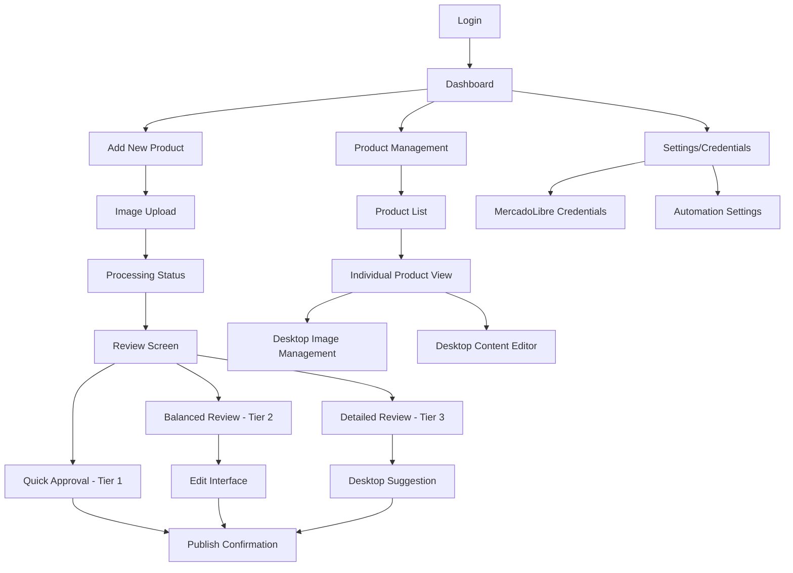

# Information Architecture (IA)

## Site Map / Screen Inventory

## Navigation Structure

**Primary Navigation:** 
- Mobile: Bottom navigation bar with Dashboard, Add Product, and Settings
- Desktop: Top navigation bar with Dashboard, Products, and Settings

**Secondary Navigation:** 
- Mobile: Contextual navigation within workflows (Back, Next, Edit)
- Desktop: Sidebar navigation for product management functions

**Breadcrumb Strategy:** 
- Mobile: Minimal breadcrumbs, focus on contextual back buttons
- Desktop: Full breadcrumb trail for complex workflows
