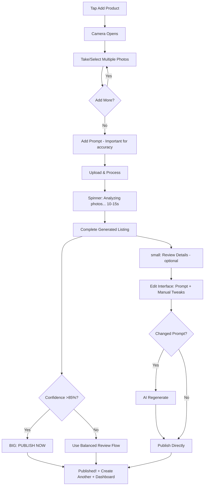
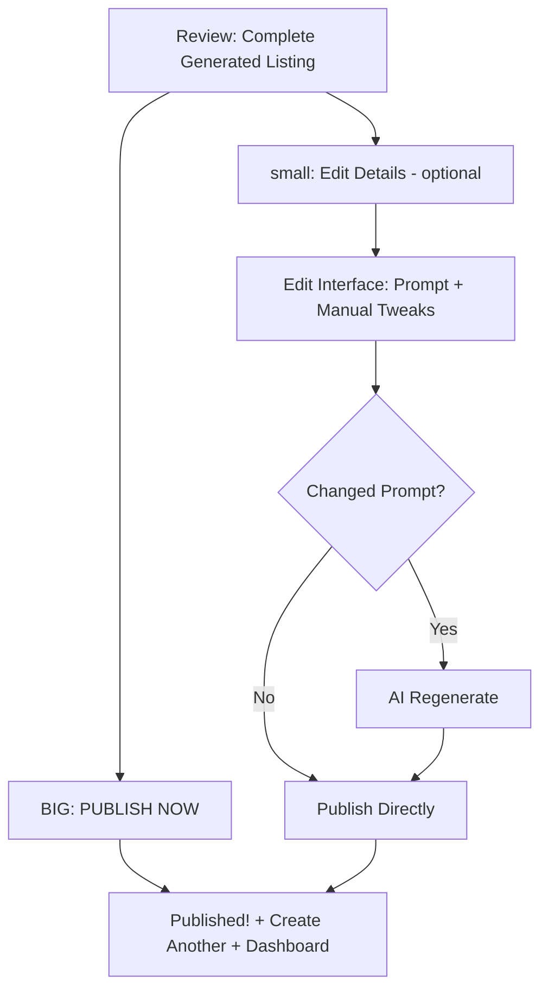
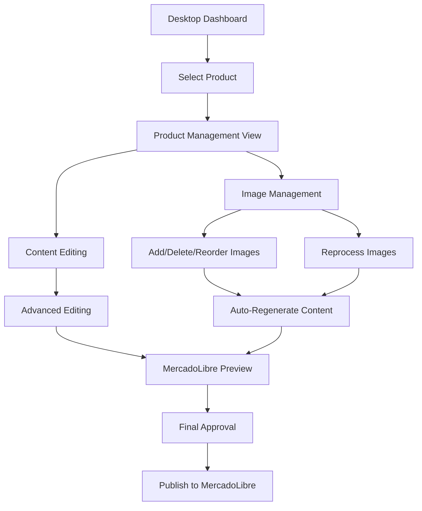

# User Flows

## MVP SCOPE (Mobile-Only)

The MVP focuses on mobile-complete workflows, with desktop functionality planned for Post-MVP implementation.

### MVP Flow Prioritization:
- ✅ **MVP:** Mobile Quick Approval (High Confidence >85%)
- ✅ **MVP:** Mobile Balanced Review (Medium Confidence 70-85%) 
- 🔄 **Post-MVP:** Desktop Power Management (Low Confidence <70%)

---

## Mobile Quick Approval Flow (High Confidence >85%) - **MVP**

**User Goal:** Create and publish a listing with minimal effort using high-confidence AI results

**Entry Points:** Dashboard "Add New Product" button

**Success Criteria:** Product published to MercadoLibre within 30 seconds of image capture

### Detailed Flow Steps

1. **Entry:** Tap "📷 Add New Product" → Camera opens immediately
2. **Photo Collection:** User can:
   - Take multiple photos with camera
   - Switch to gallery to add local photos
   - Add as many photos as needed (no limit)
   - See photo count indicator
3. **Basic Prompt:** Text input with placeholder "Describe your item (brand, size, condition...)" - **Important for accuracy**
4. **Processing:** Upload & AI analysis (10-15s) - Simple spinner with "Analyzing your photos..."
5. **Review:** Shows complete generated listing ready to publish
6. **Primary Action:** Big "PUBLISH NOW" button - direct to MercadoLibre  
7. **Secondary Option:** Small "Review Details" link (only if needed)
8. **Success:** Shows "Published!" message + "Create Another" button + back to dashboard

### Flow Diagram

**Edge Cases & Error Handling:**
- Poor image quality: Suggest retaking photos with tips
- Network interruption: Auto-save progress and resume when connection restored
- API failure: Provide retry option with clear error messaging

**Notes:** This flow is optimized for speed and confidence, with clear visual indicators of AI certainty

## Mobile Balanced Review Flow (Medium Confidence 70-85%) - **MVP**

**User Goal:** Review and approve AI-generated content with basic editing capabilities

**Entry Points:** Dashboard, or escalation from Quick Approval flow

**Success Criteria:** User can review, edit, and approve listing within 3 minutes

### Detailed Flow Steps

1. **Review Screen:** Shows complete generated listing (title, description, category, price) 
2. **Primary Action:** Big "PUBLISH NOW" button - everything is automatic
3. **Secondary Option:** Small "Edit Details" link for adjustments (optional)
4. **If Edit:** Two types of adjustments:
   - **Edit Prompt:** Change description → triggers AI regeneration
   - **Manual Tweaks:** Direct edits to title/price/description (no regeneration)
5. **Publish:** Direct to MercadoLibre - no additional confirmations needed

### Flow Diagram

**Edge Cases & Error Handling:**
- Uncertain category: Provide category picker with suggestions
- Missing attributes: Highlight required fields with helpful hints
- Content too long: Auto-truncate with option to manually adjust

**Notes:** Balances speed with control, showing component-level confidence scores

### MVP Handling for Low Confidence (<70%)

For MVP, when AI confidence is below 70%, users will:
1. **See clear messaging:** "This content needs review - please edit manually"
2. **Access mobile editing:** Use the same mobile edit interface as medium confidence
3. **Get desktop suggestion:** "For complex editing, use our desktop version (coming soon)"
4. **Have all necessary tools:** Mobile editing should handle 80%+ of low confidence cases

**Implementation Note:** Low confidence cases use the Mobile Balanced Review interface but with additional warning messaging and more prominent edit suggestions.

---

## Desktop Power Management Flow (Low Confidence <70%) - **POST-MVP**

**User Goal:** Use advanced editing tools to perfect listing content and manage images

**Entry Points:** Desktop login, mobile suggestion, or direct product management

**Success Criteria:** User can access full editing capabilities and image management tools

### Flow Diagram

**Edge Cases & Error Handling:**
- Image processing failure: Show original with manual editing options
- Complex attribute requirements: Provide guided attribute completion
- API rate limiting: Queue requests with progress indicators

**Notes:** Full-featured interface with before/after comparisons and advanced controls
